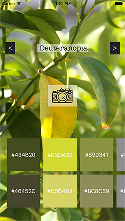
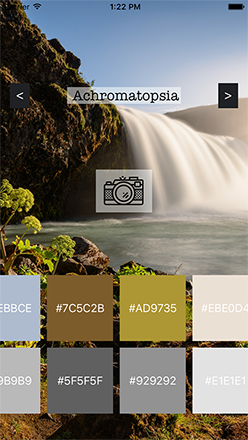

# Colorblind
A demo of the Clarifai API that helps you see the world as a colorblind person would.

This mobile app finds the most dominant colors in a picture and approximate how a colorblind person would see it.

It supports 8 different kinds of colorblindness:
* Protanopia
* Protanomaly
* Deuteranopia
* Deuteranomaly
* Tritanopia
* Tritanomaly
* Achromatopsia
* Achromatomaly

# Examples:

# How to Use:
In ViewController.swift define your appId and secret for these variables (line 21, 22):
* clarifaiAppID
* clarifaiAppSecret

Then run the app and enjoy (:

# Acknowledgements:
* The colorblind color approximations are only that - approiximations, and adapted from: http://web.archive.org/web/20081014161121/http://www.colorjack.com/labs/colormatrix/

* The camera icon comes from The Noun Project and is courtesy of Oliviu Stoian: https://thenounproject.com/term/retro-camera/697889/

* Calculations from RGB to HSL taken from: http://codeitdown.com/hsl-hsb-hsv-color/ (and appropriated to Swift)

# Further Development:
* Not a fan of displaying hex string on the colors - wanted to put the coolr names coming from this project: http://chir.ag/projects/name-that-color/#6195ED, but there wasn't enough time
* Ability to convert the image to the "colorblind" version, and see if the dominant colors ClarifAI sees are the same as the converted ones from before (I suspect this won't be the case, and it would be interesting to explore)
